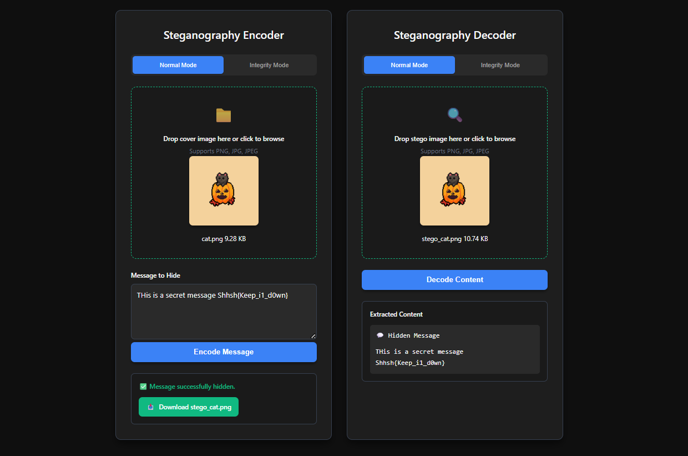

# StegByte - Steganography and Checksum Verification 

This is a full-stack web application that provides a modern, dark-themed interface for steganographic encoding and decoding. Beyond hiding simple text messages in images, this tool includes a powerful **Integrity Mode** to verify if a file has been tamed with or corrupted over time.

The application is built with a decoupled architecture, featuring a pure HTML, CSS, and JavaScript frontend and a powerful Python/Django backend that handles all heavy processing.

## Features

🔹 **Dual Steganography Modes:**
  - **Normal Mode:** Hide secret text messages inside images.
  - **Integrity Mode:** Embed a file's **SHA-256 checksum** into an image to create a portable, tamper-proof verification key.

🔹 **Full-Stack Decoupled Architecture:**
A lightweight frontend (Client) communicates with a powerful **Python backend** (Server) via a RESTful API, ensuring a responsive UI and robust processing.

🔹 **LSB Steganography Engine:**
Utilizes the **Least Significant Bit (LSB)** substitution method to invisibly embed data. Features a robust **32-bit header** to store the message length, allowing for accurate decoding of variable-length data.

🔹 **Modern, Framework-Free Frontend:**
Crafted with pure **HTML, CSS, and modern JavaScript (ES6+)** to demonstrate core web development principles and ensure fast performance.

🔹 **High-Performance Django Backend:**
Built with **Python** and the **Django REST Framework** to handle heavy image processing and API requests efficiently using the **Pillow (PIL)** library.

🔹 **Sleek, Responsive Dark Theme:**
A clean, modern interface designed to be intuitive and visually appealing on both desktop and mobile devices.

---

## The Two Modes Explained

### 1. Normal Mode

This is classic steganography. It allows you to hide a secret text message within a "cover" image.

-   **How it works**: You provide an image and a message. The tool encodes the text into the image's pixel data, producing a new "stego" image that looks identical to the original.
-   **Use case**: Sending secret messages, watermarking images, or simply for educational purposes.

-   

  

### 2. Integrity Mode

This is the advanced feature of the tool, designed to solve a critical problem in data management: **how do you prove a file has not been changed over time?**

#### The Problem: Data Corruption and Tampering

Files are not static. They can be altered, either accidentally or maliciously.
-   **Data Corruption**: A file transfer error, a failing hard drive, or even a software bug can silently flip bits in a file, corrupting it without any obvious signs.
-   **Malicious Tampering**: An attacker could modify a critical document, alter a software executable to include malware, or change a configuration file.

In these scenarios, how can you be sure the file you have today is the exact same one you started with? Just looking at the filename or file size is not enough.

#### The Solution: Cryptographic Hashing (Checksums)

Integrity Mode uses a cryptographic hash function (SHA-256) to create a unique, fixed-size "fingerprint" of a file. This hash has important properties:
1.  **Deterministic**: The same file will *always* produce the exact same hash.
2.  **Sensitive**: Changing even a single bit in the file will produce a completely different hash.
3.  **Non-Reversible**: You cannot reconstruct the file from its hash.

#### How This Tool Helps

This tool provides a novel way to store and verify this checksum. Instead of saving the hash in a separate text file (which can also be lost or altered), **Integrity Mode hides the file's hash inside an image.**

##### How it Works: A Better Way to Verify Files

🔹 **The Old Way:** Normally, to check a file’s integrity, you generate a hash (a digital fingerprint) and save it in a separate text file. The problem is, that text file can be easily deleted, modified, or misplaced, making the hash unreliable.

🔹 **The Steganographic Solution:** Integrity Mode solves this. It takes the file's hash and invisibly hides it inside the pixels of an image. The image looks completely normal to the human eye but secretly acts as a secure container for the checksum.

🔹 **The Verification Process:** Later, when you want to check the original file, the tool extracts the trusted hash from within the image. It then calculates the *current* hash of the file and compares the two.
  - If they match ✅, the file is authentic and has not been tampered with.
  - If they don't match ❌, the file has been corrupted or modified.

---

## How to Set Up and Run the Project

### Prerequisites

-   Python 3.8+
-   Node.js and npm
-   A Python virtual environment tool (like `venv`)

